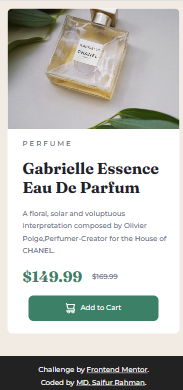

# Frontend Mentor - Product preview card component solution

This is a solution to the [Product preview card component challenge on Frontend Mentor](https://www.frontendmentor.io/challenges/product-preview-card-component-GO7UmttRfa).

## Overview

### The challenge

Users should be able to:

- View the optimal layout depending on their device's screen size
- See hover and focus states for interactive elements

### Screenshot

### Links

- Solution URL: (https://www.frontendmentor.io/solutions/product-preview-card-m8ctUvalQo)
- Live Site URL: (https://forntend-mentor-product-preview-card.netlify.app/))

## My process

### Built with

- Semantic HTML5 markup
- CSS custom properties
- Flex
- Mobile-first workflow

### What I learned

I learned of this project, how to build a product preview card using two image and how to make it responsive.

### Continued development

To be a skilled developer should be continue practicing.

### Useful resources

For this project I had no need any resource. But I will recommended Chat GPT.

- website : (https://chat.openai.com)

## Author

- Website - N/A
- Frontend Mentor - [@mdsaifurrahman00](https://www.frontendmentor.io/profile/mdsaifurrahman00)
- Twitter - N/A
